# PowerShell DSC DevOps Automation Framework

### The short version of what this actually is

This is not just a PowerShell DSC project. It is the first, foundational
piece of a larger DevOps automation platform - one built to eventually
watch over and help fix problems across most of the projects I work on,
including work done by freelance developers and a client's own
infrastructure, while I stay the one person who approves anything that
actually ships. **DSC is where this starts, not where it ends.** Before
any automation can safely diagnose and fix real problems, the machine
that automation runs on has to be provably, verifiably correct. This
repository builds that trustworthy foundation first, then adds
AI-supervised operations on top of it. See section 3 for the full
3-layer picture.

This README is written so that **future-me (or anyone else) can come
back after months away and immediately remember what this is, why it
exists, and how every piece works** - no prior PowerShell or DSC
knowledge assumed. If you're relearning this, read top to bottom in
order.

### At a glance

- **What it is:** a 3-layer DevOps automation platform. **Layer 1**
  (this repo's core, fully built) keeps Windows machines correctly
  configured using PowerShell DSC (Desired State Configuration).
  **Layer 2** is an AI skills library that diagnoses problems and
  proposes fixes as pull requests. **Layer 3** is CI/CD and
  infrastructure-as-code, getting code and infrastructure where they
  need to be.
- **Why DSC comes first:** you cannot safely automate fixes on top of a
  machine whose own state might already be broken. DSC guarantees the
  ground is solid before anything else gets built on it - it's the
  trust anchor the rest of the platform depends on.
- **What it solves today:** stops a Windows machine from silently
  drifting out of correct configuration (missing tools, broken
  settings) with nobody noticing.
- **Status:** Layer 1 is fully built, automatically tested (15/15
  passing), and verified working end-to-end on a real machine. Layer 2's
  core skill files are written; the automatic trigger connecting real
  alerts to them is the next major piece (see the roadmap). Layer 3 is
  partially planned.
- **Who it's for:** today, my own Azure backup VM and production
  systems. The intended future: freelance developers and client
  infrastructure too, with me as the sole approval gate on everything
  that actually ships.

### Table of contents

1. [The real problem this solves (read this first)](#1-the-real-problem-this-solves-read-this-first)
2. [The big idea, in plain English (read this even if you skip everything else)](#2-the-big-idea-in-plain-english-read-this-even-if-you-skip-everything-else)
3. [The 3-layer model (the mental map for the whole system)](#3-the-3-layer-model-the-mental-map-for-the-whole-system)
4. [The "widget" concept - why this is plug-and-play](#4-the-widget-concept---why-this-is-plug-and-play)
5. [Project map - what's built vs what's next](#5-project-map---whats-built-vs-whats-next)
6. [Deep dive: `ControlPlane.ps1` (the checklist - DONE)](#6-deep-dive-controlplaneps1-the-checklist---done)
7. [Deep dive: `ControlPlane.Helpers.psm1` (the toolbox - DONE)](#7-deep-dive-controlplanehelperspsm1-the-toolbox---done)
8. [Deep dive: `Apply-ControlPlane.ps1` (the "go" button - DONE)](#8-deep-dive-apply-controlplaneps1-the-go-button---done)
9. [Deep dive: `ControlPlane.config.psd1` (the answer sheet - DONE)](#9-deep-dive-controlplaneconfigpsd1-the-answer-sheet---done)
10. [Deep dive: `ControlPlane.Tests.ps1` (the tests - DONE, 15/15 passing)](#10-deep-dive-controlplanetestsps1-the-tests---done-1515-passing)
11. [Deep dive: the skills library (`.claude/agents/`)](#11-deep-dive-the-skills-library-claudeagents)
12. [Real-world testing journey: what broke, and how we actually fixed it](#12-real-world-testing-journey-what-broke-and-how-we-actually-fixed-it)
13. [Scaling past one machine (relevant once client rollouts start)](#13-scaling-past-one-machine-relevant-once-client-rollouts-start)
14. [How we're actually building this (our working method)](#14-how-were-actually-building-this-our-working-method)
15. [Quick start](#15-quick-start)
16. [Roadmap - what's left to build](#16-roadmap---whats-left-to-build)
17. [Tech stack (what's actually used, and why)](#17-tech-stack-whats-actually-used-and-why)

*(Note: GitHub auto-generates these jump-links from the headings above -
if any link doesn't land exactly right, the section is still easy to find
by scrolling, since they're numbered in order.)*

---

## 1. The real problem this solves (read this first)

I run several production systems off of **one Windows machine** - that
machine is the control plane for all of it:

- **HeRiko eBay Platform** - 12 services on a Hetzner K3s cluster
  (FastAPI, Celery, CLIP/FAISS, PostgreSQL, Prometheus, Grafana, Loki,
  Sentry, Alertmanager, EfficientNet)
- **HeRiko WooCommerce** - AWS-hosted, 50,000 products
- **Knowledge Base + AI Interview Assistant** - local FastAPI app
- **Client work** - e.g. a neighbour who sells on Amazon and wants his
  own ecommerce site deployed to the cloud

**Nothing was enforcing that this Windows machine stays correctly
configured.** If Python breaks, a virtual environment quietly
disappears, a Task Scheduler job vanishes after an update, or an
environment variable gets reset - I was fixing it by hand, every time,
often without noticing right away that something had drifted. That's
the actual, specific problem this project exists to kill permanently.

Servers and workstations **drift** - someone or something changes a
setting and nobody notices until it breaks something downstream. This
framework writes down, in one file, **exactly what the machine should
look like**, and that description can be re-checked at any time,
fixing anything wrong automatically - no manual babysitting.

**Where I actually use this:**
- **My Azure backup VM** - the control-plane machine that needs Git,
  Python, scheduled jobs, and environment variables to always be
  correct, even after a reboot, a bad update, or manual tinkering.
- **Client platforms** - the same framework, just pointed at a
  different project folder via one config file. No rewriting scripts
  per client.

**This is only step one.** Fixing machine drift matters on its own, but
it also matters because everything else this platform is meant to do -
diagnosing real incidents, proposing fixes, watching cloud costs, keeping
CI/CD healthy - only makes sense to automate on a machine you can already
trust. Section 3 explains how this piece connects to that bigger picture.

---

## 2. The big idea, in plain English (read this even if you skip everything else)

Think of it like a **robot with a checklist**, walking through a house:

- The **checklist** (`ControlPlane.ps1`) lists everything that should
  be true: "Git installed," "this folder exists," "this env var is
  set," etc.
- The **robot** (already built into every Windows computer, called the
  **LCM** - Local Configuration Manager) reads the checklist and, for
  every item, asks: *"Is this already true?"*
  - Yes -> skip it, move to the next item.
  - No -> fix it, then move on.
- Because it always checks before it touches anything, it's safe to
  run the same checklist **over and over, forever** - this property is
  called **idempotent** (a fancy word for "repeating this is always
  safe and gives the same result").

Every checklist item internally follows the same 3-step pattern:

| Step | Question it answers |
|---|---|
| **Test** | "Is this already correct?" (yes/no) |
| **Set** | "Fix it." (only runs if Test said no) |
| **Get** | "What's the current status?" (for reporting) |

### The files that work together

| File | Role | Analogy |
|---|---|---|
| `ControlPlane.ps1` | The checklist itself - what *should* be true | The recipe |
| `ControlPlane.Helpers.psm1` | The actual "is this correct?" logic, as reusable, testable functions | The recipe's individual cooking techniques, written down once |
| `ControlPlane.config.psd1` | The real values that fill in the checklist's blanks | The specific ingredients for tonight's dinner |
| `Apply-ControlPlane.ps1` | The one command that actually runs everything | Turning the oven on |
| `ControlPlane.Tests.ps1` | Automated checks that the recipe and techniques are correct | A taste-test before serving it to anyone |

Same recipe, different ingredients each time -> that's what makes this
"plug-and-play." To point the framework at a new machine or client, you
edit `ControlPlane.config.psd1` only. You never touch `ControlPlane.ps1`
just to change a folder path.

### Glossary (every acronym/term used in this project)

| Term | Plain-English meaning |
|---|---|
| **DSC** (Desired State Configuration) | Windows' built-in "checklist that fixes itself" system |
| **Resource** | One item on the checklist (e.g. "Git must be installed") |
| **Idempotent** | Running the checklist repeatedly is always safe |
| **LCM** (Local Configuration Manager) | The "robot" built into Windows that reads the checklist and enforces it |
| **MOF file** | The compiled, robot-readable version of the checklist (produced automatically - you don't write this by hand) |
| **Node** | DSC's word for "a computer this checklist applies to" |
| **`.ps1` file** | A real, runnable PowerShell script (can contain logic) |
| **`.psd1` file** | A PowerShell **data-only** file (no logic allowed - just values, which makes it safe to load) |
| **`.psm1` file** | A PowerShell **module** - a toolbox of reusable functions other files can import |
| **`Script` resource** | A checklist item where *we* write the Test/Set/Get logic by hand (used for anything custom) |
| **`File` / `Environment` resource** | Built-in checklist item types where Microsoft already wrote the Test/Set/Get logic for us |
| **`$using:`** | Inside a `Script` resource, this means "reach outside and borrow this value from the surrounding config" |
| **Pester** | PowerShell's testing tool - runs small checks against code and reports pass/fail |
| **Mock** | In a test, "fake the answer" to something risky or slow (e.g. pretend Git isn't installed) instead of actually doing it |
| **Push mode** | One operator actively sends the checklist out to machines |
| **Pull mode** | Each machine checks in on its own schedule and grabs its own checklist from a central server |
| **WinRM** | Windows Remote Management - how one Windows machine can securely run commands on another over the network |

For an even more detailed, line-by-line teaching style (the format used
while building this), see [`docs/learning-style-guide.md`](docs/learning-style-guide.md).
It also has a running **symbol dictionary** (what `$`, `@{ }`, `&`, `|`,
etc. each mean) for anyone still learning PowerShell syntax itself.

---

## 3. The 3-layer model (the mental map for the whole system)

This framework is only **one third** of a bigger picture. Keep this
map in mind so new pieces always slot into the right place instead of
turning into one tangled script:

| Layer | Question it answers | How it's answered | Status |
|---|---|---|---|
| **1. Environment** | "Is this Windows machine set up correctly to do the work?" | **DSC** - `ControlPlane.ps1` (this repo) | ✅ core checklist done |
| **2. Operations** | "Are the apps actually healthy? Fix problems automatically." | **CLAUDE.md + skills library** - Prometheus/Sentry fires an alert -> Claude Code diagnoses it -> a skills agent drafts a fix as a pull request -> I approve it | 🔜 planned (`.claude/agents/`) |
| **3. Deployment** | "Get code and infrastructure to where it needs to be." | **GitHub Actions + Terraform** - CI/CD pipelines, infrastructure-as-code, zero-downtime deploys | 🔜 planned (`azure/`, `.github/workflows/`) |

**Why split it into layers at all?** Each layer answers exactly one
question and doesn't need to know about the others. DSC (layer 1)
never needs to know an app exists - it only cares whether Git, Python,
and env vars are correct. That separation is what keeps each layer
simple enough to actually reason about, instead of one giant script
that tries to do everything and breaks in confusing ways.

Together, all three layers form a machine that mostly runs itself:
the environment stays correct (layer 1), problems get caught and fixed
automatically (layer 2), and code/infrastructure changes roll out
safely (layer 3).

---

## 4. The "widget" concept - why this is plug-and-play

The goal isn't a one-off script for one machine. It's a **reusable
widget** I can drop into any Windows machine - mine or a client's -
and get a working DevOps control plane out of it in minutes:

1. Copy this framework onto the target machine.
2. Edit `ControlPlane.config.psd1` - project name, paths, env vars.
   Takes about 5 minutes.
3. Run `.\Apply-ControlPlane.ps1`.
4. The machine is now a DevOps control plane: environment enforced
   (layer 1), and ready to have operations automation (layer 2) and
   deployment pipelines (layer 3) layered on top.

**A real scenario this is built for:** a neighbour of mine sells on
Amazon and wants an ecommerce site deployed to the cloud. I show up
(or connect remotely), drop this framework onto his machine, fill in
the config file, run one command - his machine is provisioned. I then
deploy his actual application on top of it via Terraform and GitHub
Actions. He never has to touch the infrastructure himself.

**Same widget, two use cases:** today it's keeping my own Azure backup
VM correct. Tomorrow it's the first five minutes of onboarding any new
client machine, with nothing rewritten in between.

---

## 5. Project map - what's built vs what's next

```
powershell-dsc-devops-automation-framework/
├── README.md                              ✅ you are here
├── CLAUDE.md                              ✅ internal build spec / AI context
│
├── windows/                                                                  Layer 1
│   ├── ControlPlane.ps1                   ✅ DONE - the checklist (8 items, see below)
│   ├── ControlPlane.Helpers.psm1          ✅ DONE - the testable "is this correct?" logic
│   ├── ControlPlane.config.psd1           ✅ DONE - the answer sheet / template
│   ├── Apply-ControlPlane.ps1             ✅ DONE - one-command "run the checklist" script
│   └── ControlPlane.Tests.ps1             ✅ DONE - Pester tests (15/15 passing)
│
├── docs/
│   ├── learning-style-guide.md            ✅ DONE - how we explain things, plus glossary
│   ├── images/                            ✅ DONE - real testing + troubleshooting proof (sections 10-11)
│   ├── how-to-plug-in.md                  🔜 planned - step-by-step "use this on a new machine"
│   └── azure-vm-setup.md                  🔜 planned - Azure VM + DSC extension guide
│
├── azure/                                                                    Layer 3
│   ├── main.tf, variables.tf, outputs.tf  🔜 planned - Terraform to provision an Azure VM + wire up DSC
│   └── azure-ad-dsc.ps1                   🔜 planned - DSC for Azure AD / Entra ID objects
│
├── linux/
│   └── control-plane.yml                  🔜 planned - Ansible equivalent, for Linux machines - Layer 1
│
├── .github/workflows/                                                        Layer 3
│   └── validate-dsc.yml                   🔜 planned - tests this checklist automatically on every change
│
└── .claude/agents/                        🔜 planned - AI-assisted incident/cost/pipeline workflows - Layer 2
```

---

## 6. Deep dive: `ControlPlane.ps1` (the checklist - DONE)

Eight checklist items, in the order they run:

| # | Item name | What it checks | If wrong |
|---|---|---|---|
| 1 | `ProjectDirectory` | Does the project folder exist? | Creates it |
| 2 | `GitInstalled` | Is Git installed and on PATH? | Installs Git via `winget` |
| 3 | `PythonInstalled` | Is Python 3.11+ installed? | Installs Python via `winget` |
| 4 | `VirtualEnvironment` | Does the project's `.venv` folder exist? | Creates it (`python -m venv`) |
| 5 | `PipPackagesInstalled` | Are all packages from `requirements.txt` installed? | Runs `pip install -r requirements.txt` |
| 6 | `ScheduledJob_<name>` (one per job) | Is each scheduled job registered in Task Scheduler? | Registers it |
| 7 | `SslCertificatePresence` | Do SSL certificate files exist? | **Warns only** - never auto-creates certificates (security-sensitive, must be done by a human) |
| 8 | `EnvVar_<name>` (one per variable) | Is each required environment variable set to the right value? | Sets it |

**Ordering:** some items use `DependsOn` to run in the right sequence
(e.g. Python must be installed before the virtual environment can be
created). Items 6 and 8 are generated automatically with a `foreach`
loop - one per job / one per variable listed in the answer sheet - so
adding a 5th scheduled job or a 10th environment variable never
requires touching this file.

**The 6 items with custom logic (2, 3, 4, 5, 6, 7) don't check anything
themselves anymore** - each just imports and calls a function from
`ControlPlane.Helpers.psm1` (see section 7). That's a deliberate
refactor, explained there, that's what makes this checklist testable.

**A real gotcha we hit and fixed:** a stray "smart" dash character
(`—` instead of a plain `-`) silently broke the whole script, because
Windows PowerShell reads files without a special "this is UTF-8" marker
using an older rulebook that misreads fancy punctuation. Lesson: stick
to plain keyboard characters in `.ps1` files. Always sanity-check a
script with:
```powershell
[System.Management.Automation.Language.Parser]::ParseFile($path, [ref]$null, [ref]$errors)
```

---

## 7. Deep dive: `ControlPlane.Helpers.psm1` (the toolbox - DONE)

A `.psm1` file is a PowerShell **module** - a file that only defines
reusable functions, for other files to import and use. This one holds
the actual "is this correct?" logic behind six of the checklist items:

| Function | Answers |
|---|---|
| `Test-GitAvailable` | Is Git installed and on PATH? |
| `Test-PythonVersionOk` | Is the installed Python new enough? |
| `Test-VirtualEnvExists` | Does the project's `.venv` folder exist? |
| `Test-RequiredPipPackagesInstalled` | Are all `requirements.txt` packages installed? |
| `Test-ScheduledJobRegistered` | Is this Task Scheduler job registered? |
| `Test-SslCertificatePresent` | Does the SSL certificate folder exist? |

**Why this exists:** originally, this logic lived directly inside each
checklist item's `TestScript`. That worked, but it turned out to be
genuinely hard to test in isolation - DSC compiles `TestScript` blocks
in a way that isn't easy to run outside of a real DSC compile (see the
real proof of this in section 10). Pulling the logic out into plain
functions here means `ControlPlane.ps1` stays short, and
`ControlPlane.Tests.ps1` can call these functions directly, with
mocks, no DSC involved at all.

`ControlPlane.ps1` finds this file automatically - it works out its
own folder at compile time and imports this module from right next to
itself, so both files just need to travel together (which they always
do, since they live in the same `windows/` folder).

---

## 8. Deep dive: `Apply-ControlPlane.ps1` (the "go" button - DONE)

The one command that actually runs everything - nothing before this
point in the project touches a real machine; this is what does.

1. **Checks prerequisites** - must be run as Administrator (DSC needs
   to install software, register scheduled tasks, and set machine-wide
   environment variables), and the config file must exist.
2. **Loads the checklist** - `ControlPlane.ps1`, via *dot-sourcing*
   (`. .\ControlPlane.ps1`), which makes its `Configuration` available
   to call, instead of running it in an isolated bubble.
3. **Compiles** the checklist + your answer sheet into a MOF file.
4. **Applies it** - `Start-DscConfiguration -Wait -Verbose -Force`,
   which is the actual moment the LCM checks the machine and fixes
   anything wrong.
5. **Reports status** - a plain-English summary at the end.

Every step is wrapped in `try { } catch { }` - if anything fails, it
stops immediately with a clear red message instead of leaving the
machine half-configured.

---

## 9. Deep dive: `ControlPlane.config.psd1` (the answer sheet - DONE)

This is the **only file you edit** to reuse the framework on a new
machine - my Azure backup VM today, a client's server tomorrow.

```powershell
@{
    AllNodes = @(
        @{
            NodeName         = 'localhost'
            ProjectName      = 'MyProject'
            ProjectPath      = 'C:\Projects\MyProject'
            PythonVersion    = '3.11'
            VenvName         = '.venv'
            RequirementsFile = 'requirements.txt'
            ScheduledJobs    = @( @{ Name = 'DailyMaintenance'; Script = 'scripts\daily.bat'; Time = '06:30' } )
            SSLCertPath      = 'certs'
            EnvVars          = @{ APP_ENV = 'production' }
        }
    )
}
```

To reuse this for a different project or client, copy this file, give
it a new name, and change the values - `ProjectPath`, `ScheduledJobs`,
`EnvVars`, etc. `ControlPlane.ps1` never needs to change.

**Security rule:** never put real secrets (passwords, API keys,
tokens) in this file. It's plain text and meant to be committed to
source control. Secrets belong in a proper secret store (e.g. Azure
Key Vault), referenced by name, not pasted in here.

---

## 10. Deep dive: `ControlPlane.Tests.ps1` (the tests - DONE, 15/15 passing)

Two kinds of tests live here:
1. **Unit tests** against `ControlPlane.Helpers.psm1` - mock things
   like `Get-Command` and `Test-Path`, then check each function
   returns the right `$true`/`$false` for each situation.
2. **A compile check** against `ControlPlane.ps1` itself - compiles it
   with the sample answer sheet and confirms all 8 checklist items
   show up correctly in the resulting MOF file.

### Real proof - before and after the refactor in section 7

**Before:** trying to test the *old* inline logic directly - this is
the actual error PowerShell throws, because `$using:` variables only
resolve inside a real DSC compilation, not on their own:

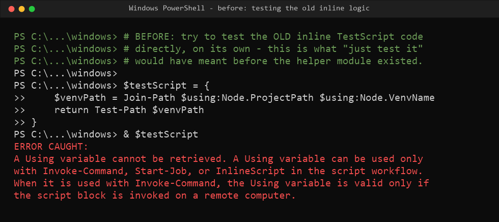

**After:** the real `Invoke-Pester` run against the current
`ControlPlane.Tests.ps1`, once the logic moved into
`ControlPlane.Helpers.psm1`:

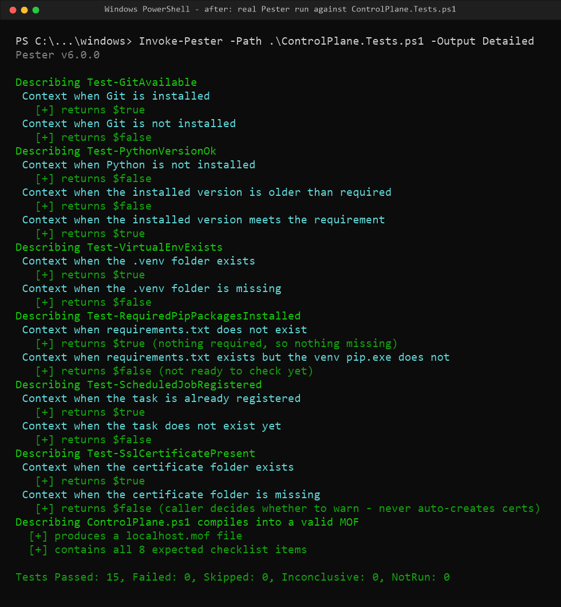

Run it yourself with:
```powershell
Invoke-Pester -Path .\windows\ControlPlane.Tests.ps1 -Output Detailed
```

---

## 11. Deep dive: the skills library (`.claude/agents/`)

Everything from section 6 through 10 is **Layer 1** - the DSC checklist
that keeps a Windows machine correctly configured. This section is
**Layer 2** - the "operations" layer that helps diagnose and fix problems
in whatever's actually *running* on top of that machine, using Claude
Code. See section 3 for how the layers relate.

### The 4 skills

| File | What it does |
|---|---|
| `01-incident-diagnosis.md` | Investigates an alert/error and reports a root cause. Read-only - never changes anything. |
| `02-remediation-pr.md` | Turns a diagnosis into a real PR - a fix, a test, and a rollback plan. Never merges itself. |
| `03-cost-drift-analysis.md` | Flags cloud spend that's drifted from baseline, across Hetzner/AWS/Azure. Report only. |
| `04-pipeline-health.md` | Diagnoses a failed CI/CD run, hands off to remediation if a code fix will work. |

Here's `01-incident-diagnosis.md` actually open and readable, proving this
isn't just described in this README - it's a real file, in a real folder,
sitting right next to the DSC checklist:

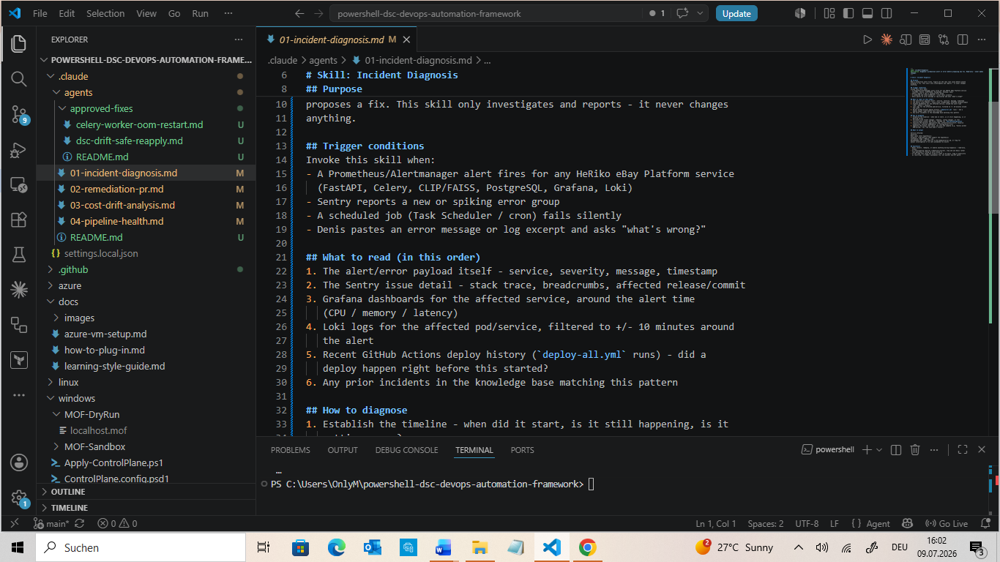

### The approval gate - and its one narrow exception

Every PR these skills produce requires manual approval before merging -
with exactly one exception, and it's deliberately narrow. The
`approved-fixes/` folder holds problem-and-solution pairs that have been
manually approved **at least twice already** - only then can a pattern be
promoted to auto-merge-with-alert, and only Denis can promote one; no
skill can add to this folder itself.

Two real example entries, showing what a graduated pattern actually looks
like once documented - one tied to this very repo, one tied to the real
production platform this framework was built for:

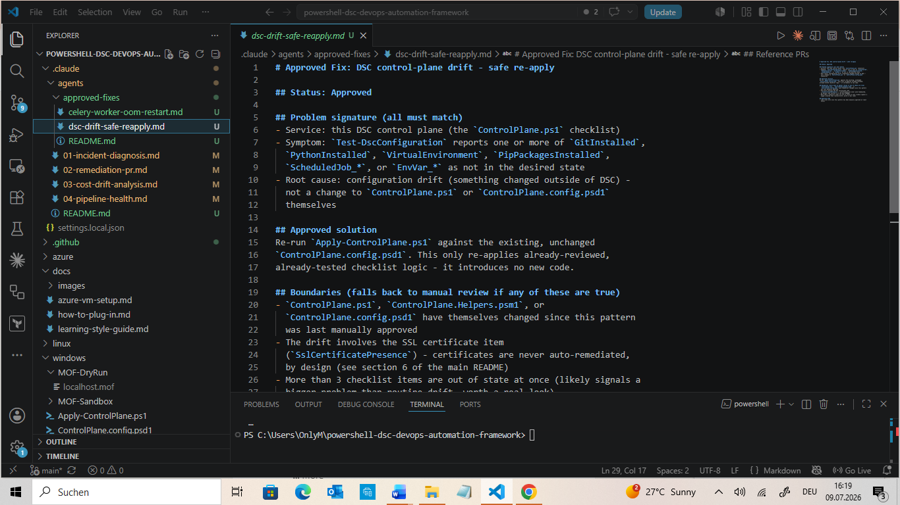

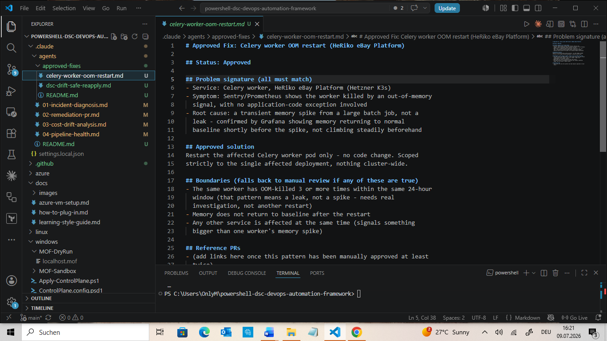

Neither entry has real reference PRs linked yet (see the placeholder line
in each file) - that's honest, not a gap: no pattern has actually been
manually approved twice yet in real use. These are the rulebook, written
in advance, ready for when that happens.

### Who can use this

Anyone who clones this repo gets this folder automatically - a freelance
developer or a client's own team, not just Denis. They can invoke a skill
themselves to diagnose a problem or draft a fix PR, and every skill's
output includes its evidence (logs, test results) specifically so a
teammate can independently verify a suggested fix is real *before* it
ever reaches Denis for approval. The approval gate itself never moves,
regardless of who invoked the skill.

---

## 12. Real-world testing journey: what broke, and how we actually fixed it

Everything above was proven two ways already (mocked unit tests, a compile
check). But the only real proof is running it on an actual machine - so we
did. It hit real, genuine problems along the way - both environment issues
while getting it running for the first time, and a later code-quality pass
that needed real judgment calls, not blind rule-following. All of it is
documented here exactly as it happened, screenshots included, because this
is honestly the most useful section in the whole README if you ever hit
the same walls.

### Step 0 - proof the checklist actually compiles into a real file

Before any of the incidents below, here's the first piece of hard
evidence: running the compile step for real produces an actual
`localhost.mof` file on disk - not a hypothetical, an actual file you can
open and read. This is the "robot-readable" file the glossary in section 2
talks about. You can see the real content here: the `File` resource for
`ProjectDirectory` (with its real `DestinationPath`), and the start of the
`Script` resource for `GitInstalled` (with its real `GetScript`,
`TestScript`, and `SetScript` text baked in):

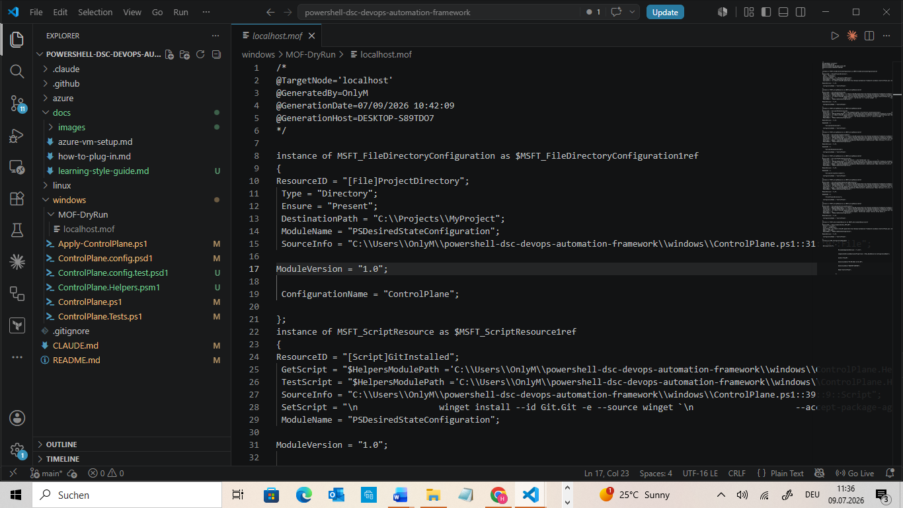

This is the proof that `ControlPlane.ps1` + `ControlPlane.config.psd1`
genuinely turn into a real, valid, machine-readable file when compiled -
not just PowerShell code that looks right on screen.

### Incident 1 - guessing a command's parameters wrong (twice)

**What we wanted:** a safe "just check, don't fix anything" dry run,
before touching a real machine - using PowerShell's built-in
`Test-DscConfiguration` command.

**First guess:**
```powershell
Test-DscConfiguration -Path .\MOF-DryRun -Detailed
```
This failed immediately with a cryptic error: *"the parameter set cannot
be resolved."* Not an error message that tells you what's actually wrong
- just that something about the combination of parameters we gave it
doesn't exist.

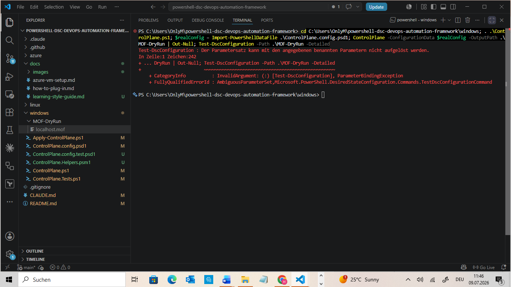

**Second guess:** maybe the parameter name itself was wrong, not just the
combination. Tried a different parameter name for the same idea:
```powershell
Test-DscConfiguration -ReferenceConfiguration .\MOF-DryRun\localhost.mof -Detailed
```
Same exact error, word for word:

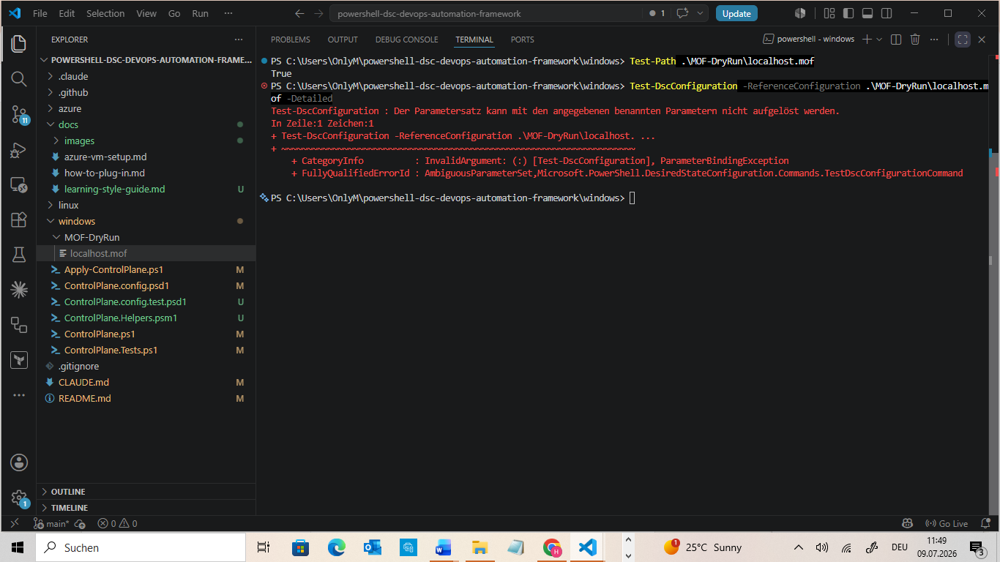

**How we actually fixed it:** two wrong guesses is the signal to stop
guessing entirely. Instead of trying a third combination, we asked
PowerShell itself what the command genuinely accepts:
```powershell
Get-Command Test-DscConfiguration -Syntax
```

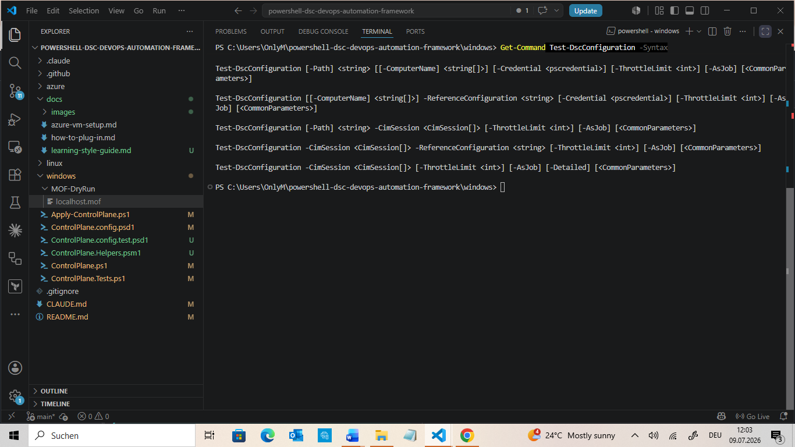

This printed every parameter combination the command actually supports on
this machine, no guessing involved. Reading it carefully, the answer was
simple: `-Detailed` is only allowed together with `-CimSession` - it can
never be combined with `-Path` or `-ReferenceConfiguration`, which is
exactly what both of our guesses tried to do. That's why both failed with
the identical error - we were making the same category of mistake both
times, just with a different parameter name.

**The lesson (simple version):** when you're not sure what a command
accepts, don't keep guessing - ask the tool itself with
`Get-Command -Syntax` (or `Get-Help -Full`). It's faster, and it's always
correct, because it's reading the command's real definition, not someone's
memory of it.

### Incident 2 - the correct syntax still couldn't connect

**What happened:** with the parameter mistake fixed, we ran the corrected
command:
```powershell
Test-DscConfiguration -Path .\MOF-DryRun
```
New error this time - progress, but a different wall:

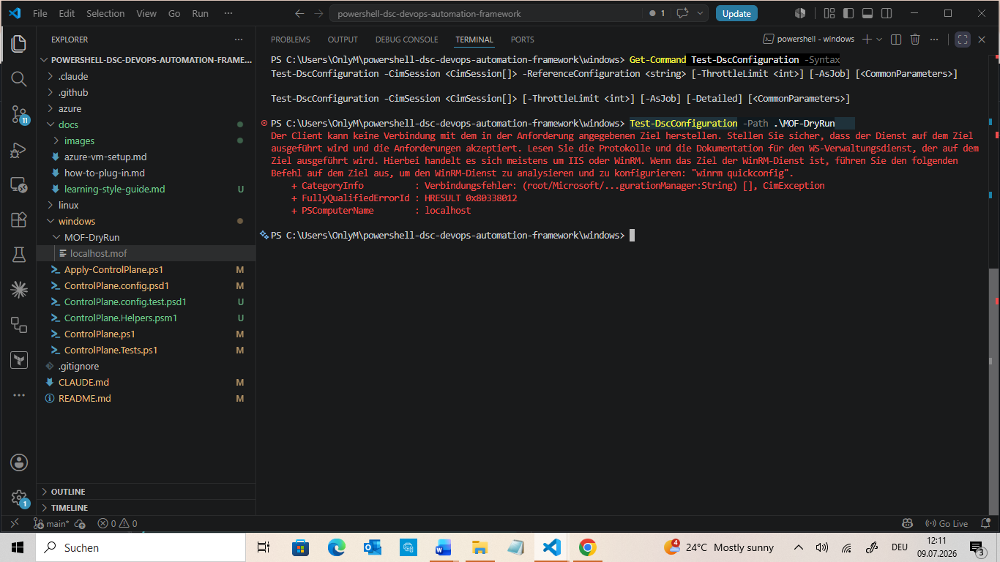

The error talked about not being able to connect to "the destination
specified in the request," and mentioned **WinRM** (Windows Remote
Management) by name, suggesting we run `winrm quickconfig`.

**Why this happens (simple version):** Windows DSC always talks to
whatever machine it's managing over WinRM - even when it's managing the
*exact same machine it's running on*. That's not a bug in our project;
it's just how DSC has always worked on Windows. Most personal Windows
machines don't have WinRM turned on by default (servers usually do), so
this is a one-time setup step, not something wrong with `ControlPlane.ps1`
or `ControlPlane.Helpers.psm1`.

### A temporary workaround - checking the real machine without DSC at all

Rather than fix WinRM immediately, we first found a way to get the
*information* we wanted (is Git installed? Is Python new enough? Does the
venv folder exist?) without going through DSC's `Test-DscConfiguration` at
all - by calling the real functions inside `ControlPlane.Helpers.psm1`
directly:
```powershell
Import-Module .\ControlPlane.Helpers.psm1 -Force
Test-GitAvailable
Test-PythonVersionOk -RequiredVersion '3.11'
Test-VirtualEnvExists -ProjectPath 'C:\Projects\MyProject' -VenvName '.venv'
```

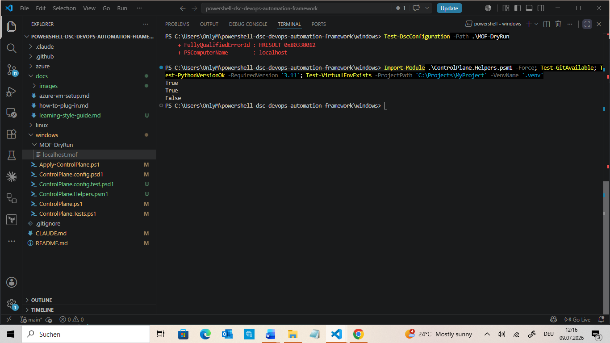

This worked immediately, no WinRM needed, and gave real, honest answers
about the actual machine (Git: yes, Python 3.11+: yes, that particular
`.venv` folder: no, correctly, since it didn't exist yet). This was a
genuinely useful workaround **for checking only** - but it doesn't
actually fix anything, and it doesn't prove the real DSC *apply* mechanism
works, only that the underlying logic functions is sound.

### Incident 3 - the real apply hit the same wall, with no workaround available

Moving on to the actual goal - applying the sandbox configuration for
real, via `Apply-ControlPlane.ps1`, in a proper Administrator PowerShell
window - hit the *exact same* WinRM connection error:

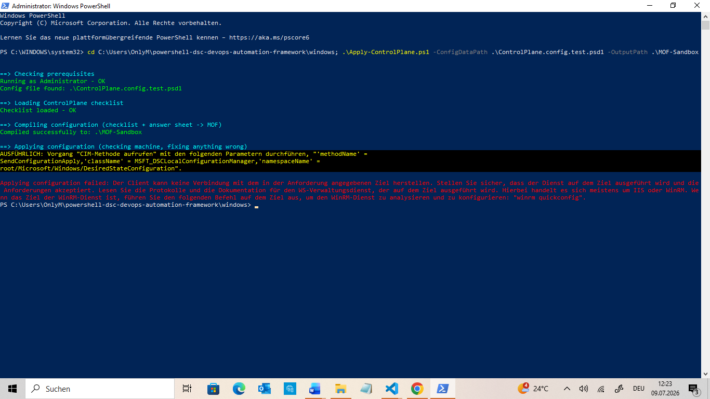

This confirmed something important: the direct-function-call workaround
only worked for *checking*. There's no equivalent shortcut for actually
*applying* a configuration - `Start-DscConfiguration` (what
`Apply-ControlPlane.ps1` uses to do the real work) always goes through
DSC's LCM, and the LCM always requires WinRM, no exceptions. This time,
WinRM genuinely had to be fixed properly - there was no way around it.

### Actually fixing WinRM

Ran Windows' own built-in fix:
```powershell
winrm quickconfig
```
This started the WinRM service correctly, but hit one more small snag: it
couldn't add a Windows Firewall exception, because the current network
connection was classified as "Public" (Windows deliberately refuses to
open a management port on an untrusted network - a sensible default, not
something to carelessly override). Rather than change the network profile
(a bigger change than necessary, with its own trade-offs), we tested
whether the *local-only* use case even needed that firewall exception -
and it didn't. Confirmed immediately with a safe, read-only retry:

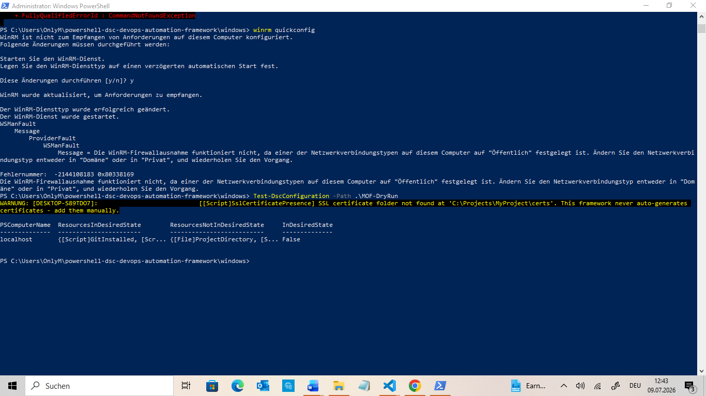

**The lesson (simple version):** when a fix partially fails, don't assume
you need the *whole* fix - test whether what you actually need still
works. In our case it did, so no firewall or network profile changes were
ever needed.

### The payoff - retrying the real apply, and it working end to end

With WinRM genuinely running now, we retried the real sandbox apply. Here
it is actually in progress - you can see it working through each
checklist item, checking first, then fixing only what's actually wrong:

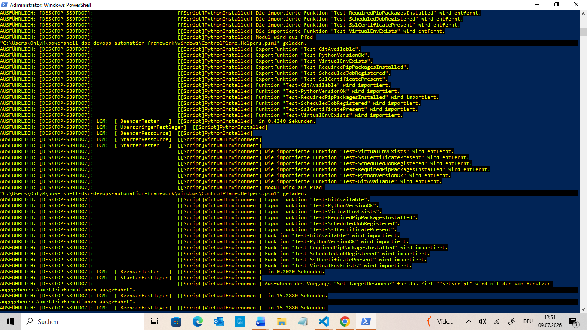

It completed successfully: created the sandbox folder, created a real
virtual environment (that's the ~15 second pause in the log - genuinely
creating a `.venv` takes time), set the test environment variable, and
correctly *warned but never touched anything* about the missing SSL
certificate folder - exactly as designed back in section 6:

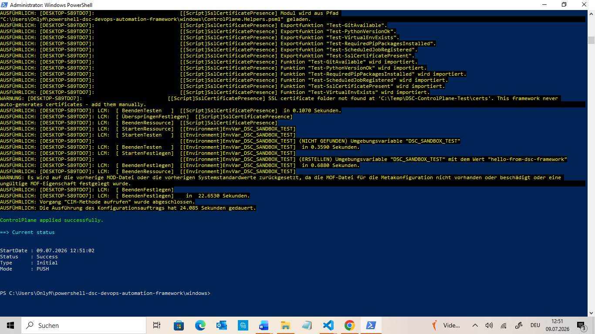

Then, in a completely separate command afterward - not just trusting the
log's word for it - we verified independently that everything it claimed
had actually, really happened on the machine:

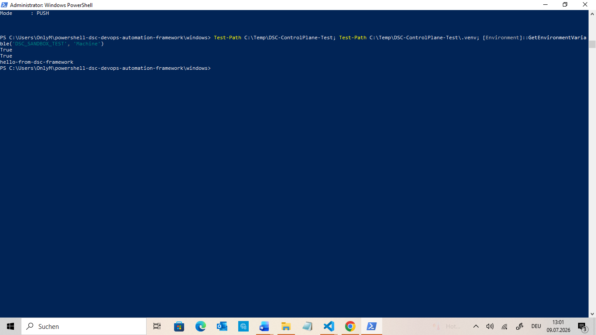

### If you only remember one thing from this section

Three real problems, in order, none of them a bug in `ControlPlane.ps1`
itself - all of them PowerShell/DSC's own tooling requirements:
**(1)** we guessed a command's parameters wrong twice, so we asked the
tool for its real syntax instead of guessing a third time;
**(2)** the correct syntax still couldn't connect, because DSC requires
WinRM even to manage the local machine - we found a temporary workaround
for checking only, but the real apply had no such shortcut, which is what
forced us to actually fix WinRM properly, with Windows' own
`winrm quickconfig`; **(3)** that fix partially failed (a firewall
exception blocked by the network being "Public"), so instead of making a
bigger change than necessary, we tested whether we actually needed that
piece - we didn't. Once everything was resolved, the framework worked
correctly on the very next real attempt, with zero changes ever needed to
the checklist itself.

### A later incident - PSScriptAnalyzer, and a real judgment call

A separate session, a different tool: **PSScriptAnalyzer** is PowerShell's
built-in code-quality checker - think of it as a spell-checker, but for
coding habits instead of spelling. It doesn't run your code, it just reads
it and flags patterns that experienced PowerShell developers generally
consider bad habits.

```powershell
Invoke-ScriptAnalyzer -Path .\windows -Recurse -Severity Warning,Error
```

This flagged 13 things - but they needed two genuinely different
responses, not one blanket fix:

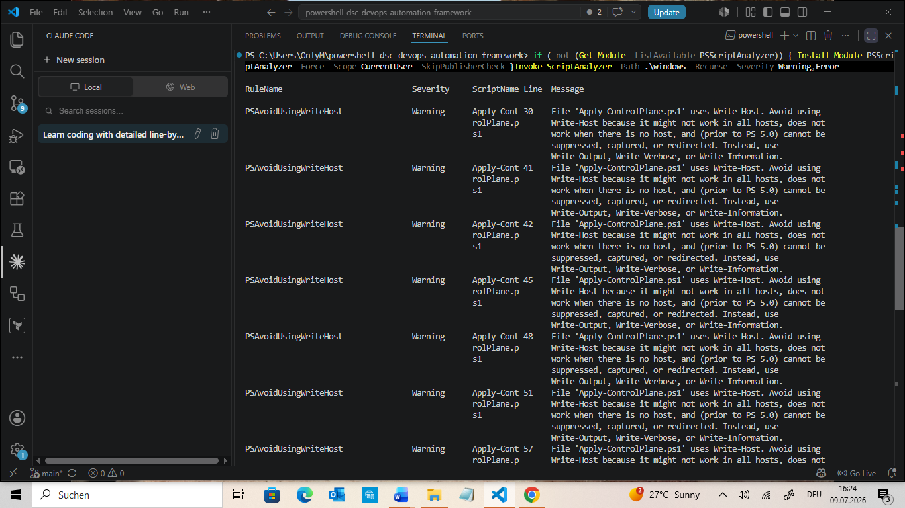

**12 of the 13** were "you used `Write-Host`." Its generic advice: use
`Write-Output` instead, since `Write-Host`'s output can't be captured by
other scripts. **We deliberately did not follow that advice.**
`Apply-ControlPlane.ps1` is an interactive tool meant to be *watched* by a
human while it runs - the colored progress messages (green "OK," cyan
section headers) only work because of `Write-Host`. Switching to
`Write-Output` would have satisfied the linter while making the actual
tool worse. Instead, we wrote a **suppression** - a formal, documented "I
see this rule, and I'm deliberately not following it here, for this
specific reason" - attached directly to the script:

```powershell
[Diagnostics.CodeAnalysis.SuppressMessageAttribute(
    'PSAvoidUsingWriteHost', '',
    Justification = 'This script is an interactive, human-run console tool...'
)]
```

The first attempt at this suppression actually failed - PowerShell
requires the `Justification` text to be one single, plain block of text,
and the first version built it by gluing several pieces together with
`+`, which isn't allowed at that specific spot. Here's the real fix,
before and after:

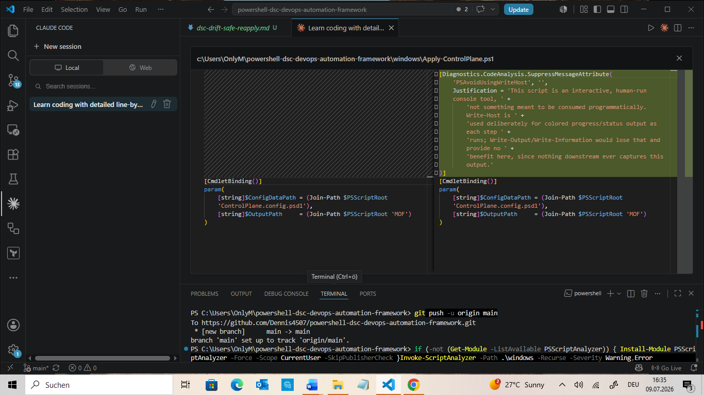

**The 13th finding was different and genuinely worth fixing**, not
suppressing: a function named `Test-VirtualEnvExists` was flagged for
"using a plural noun." PowerShell style expects singular function names -
though the rule itself is a bit naive (it just checks whether the name
ends in the letter "s," and "Exists" happens to, even though it isn't
really plural). Since the fix was easy and genuinely made the codebase
more consistent (matching a function we already had,
`Test-SslCertificatePresent`), we renamed it - in all 3 files that
referenced it:

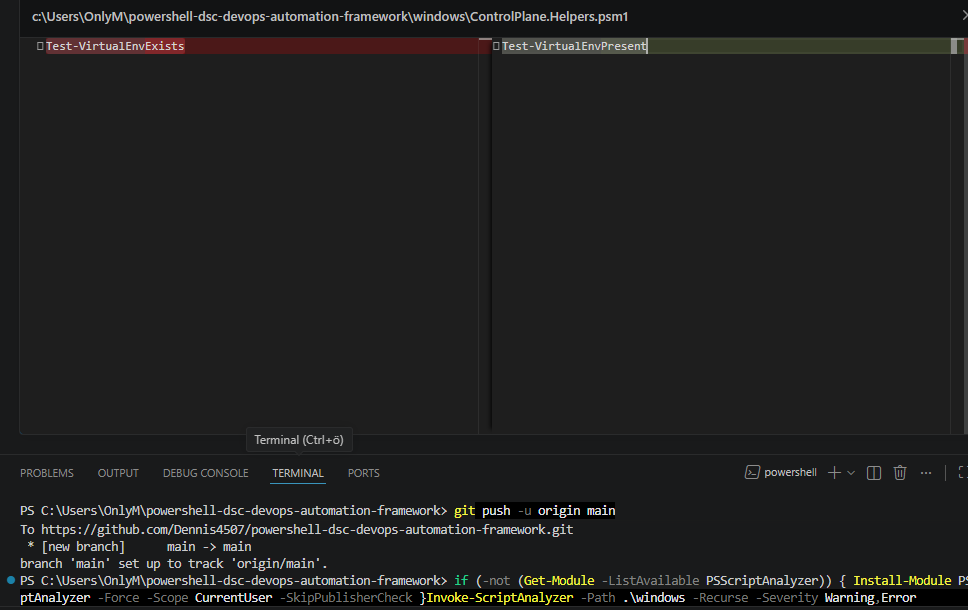

**Why we had to check two different things afterward, not just one:**
renaming something used in 3 places is risky - miss updating even one
spot and things silently break. So after both fixes, we re-ran *two*
separate checks: `Invoke-ScriptAnalyzer` again (did the fixes satisfy the
linter?) and the full Pester suite again (did the rename break anything
across the 3 files it touched?):

Here's that re-run actually scrolling through each individual test case,
followed by the final confirmed result with the summary line:

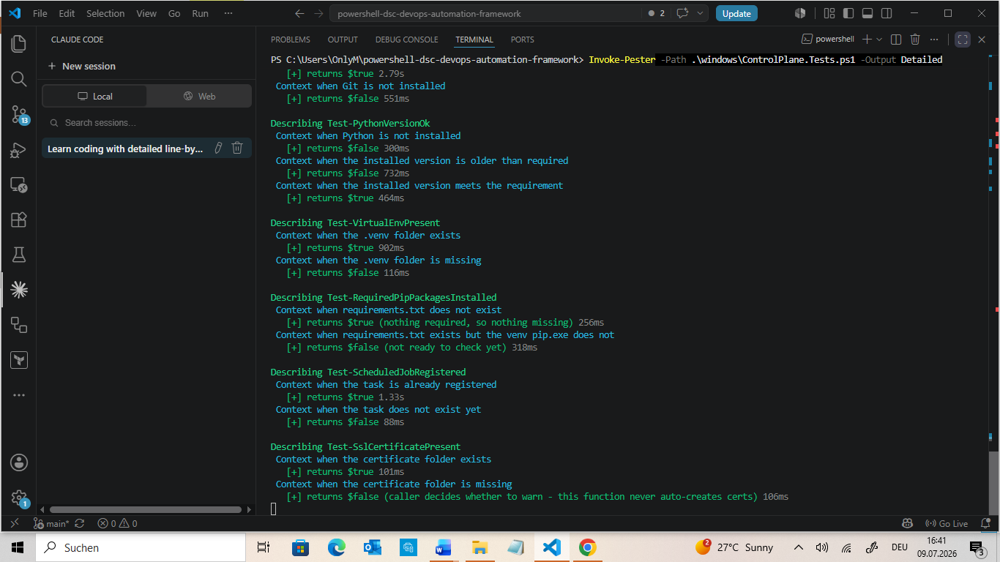

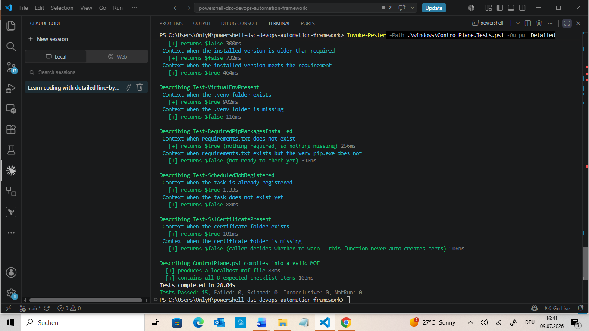

Both came back clean - PSScriptAnalyzer printed nothing (verified
directly, not assumed), and Pester stayed at 15 passed, 0 failed.

**The lesson:** a linter's suggestions are exactly that - suggestions, not
commands. The right response is to understand *why* a rule exists, decide
whether it actually applies to your specific situation, and document that
decision either way - fix it properly when it's a real improvement,
suppress it explicitly with a real reason when it isn't. Blindly obeying
every warning, or blindly ignoring all of them, are both worse than
actually thinking about each one.

### One more incident - GitHub blocked the push, briefly

Pushing this repo to GitHub for the first time hit its own real snag.
Before pushing anything, we checked the current state:

```powershell
git status
git remote -v
```

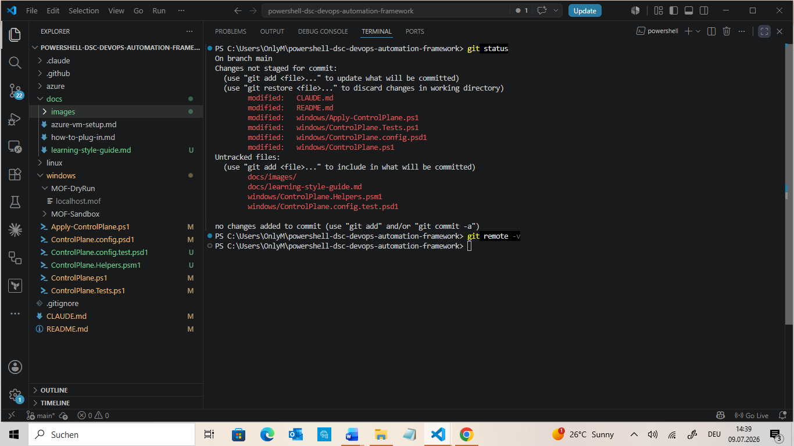

No remote existed yet, so we created the GitHub repo and pushed. The push
was **rejected**, with a message about a Personal Access Token needing
`workflow` scope: GitHub treats anything inside `.github/workflows/`
specially, since that folder controls automated pipelines - and this
project's initial scaffold included an empty placeholder file there
(`validate-dsc.yml`, just a `# TODO` comment) that our access token wasn't
approved to touch.

Rather than spend time editing token permissions mid-push, we used a
faster, equally valid fix:

```powershell
git rm --cached .github/workflows/validate-dsc.yml
git commit -m "Remove empty workflow stub for now"
git push -u origin main
```

`git rm --cached` means "stop tracking this file in git, but leave it
sitting on disk untouched." With that one empty file excluded, nothing
left in the push touched the restricted folder, and everything else - all
the real files - went through cleanly. The real `validate-dsc.yml` gets
added back properly once it has actual content (see the roadmap).

**The lesson:** a blocked push doesn't always mean "fix your credentials"
- sometimes the faster, equally correct move is to remove the one thing
actually causing the conflict and deal with it properly later, rather than
stopping everything to fix a permission that isn't needed yet.

---

## 13. Scaling past one machine (relevant once client rollouts start)

Right now `AllNodes` has one entry (`localhost` - my backup VM). If
this ever needs to manage many machines (e.g. a whole client fleet),
the same shape just grows:

- **Don't hand-type more entries.** Generate `AllNodes` from a real
  inventory source - a CSV list, an Active Directory query, or a cloud
  API - using a small loop, so adding machine #201 means adding one row
  of data, not editing PowerShell.
- **Push mode** (what we use today - one operator runs the checklist
  against one machine) works fine for a handful of machines, but
  doesn't scale: it needs one live network connection per machine and
  admin credentials for all of them at once.
- **Pull mode** is the real-world answer at scale: each machine checks
  in with a central **Pull Server** on its own schedule and grabs its
  own copy of the checklist - nobody has to push to 200 machines by
  hand, and a machine that was offline just catches up next time it
  checks in. Azure has a managed version of this called **Azure
  Automation State Configuration**, which ties directly into the
  `azure/` folder planned above.

---

## 14. How we're actually building this (our working method)

This project is being built **as a learning exercise, one small,
fully-explained piece at a time** - not generated all at once. The
style used for every explanation (beginner-friendly, every acronym and
symbol defined, small chunks, concrete examples) is written down in
[`docs/learning-style-guide.md`](docs/learning-style-guide.md) so it
stays consistent across sessions. That file is also where new gotchas
and vocabulary get recorded as they come up - treat it as a living
notebook, not a one-time doc.

---

## 15. Quick start

This exact flow has been run for real, end to end, and verified
independently afterward - see section 12 for the proof (and the real
environment issues we hit and fixed along the way).

```powershell
# 1. Copy the framework into your project (or point it at one)
# 2. Edit windows/ControlPlane.config.psd1 for this machine/client
# 3. Run, as Administrator:
.\windows\Apply-ControlPlane.ps1
# This compiles the checklist + answer sheet into a MOF file, then
# tells the LCM to check the machine against it and fix anything wrong.

# Optional - run the test suite first, to confirm everything's healthy:
Invoke-Pester -Path .\windows\ControlPlane.Tests.ps1 -Output Detailed
```

---

## 16. Roadmap - what's left to build

- [ ] **The trigger/wiring layer (the biggest real gap right now).** Today,
  a person still has to manually ask Claude Code to use a skill. Real
  automation needs something that automatically notices a real problem
  (a Sentry alert, a failed GitHub Actions run, an Alertmanager firing)
  and starts the right skill without a person doing it by hand - either a
  webhook receiver, or Claude Code checking on a schedule. This belongs
  on the same Azure VM as the rest of Layer 3, since it needs to be
  running even when a personal PC is turned off (Layer 2 + Layer 3)
- [ ] Actually run `terraform apply` against a real Azure subscription, once
  reviewed and ready to incur real cost (Layer 3)
- [ ] Prove `azure/azure-ad-dsc.ps1` against a free Microsoft 365
  developer tenant, following `docs/m365-dsc-production-notes.md` (Layer 3)
- [ ] `.github/workflows/validate-dsc.yml` - automatically re-checks the checklist for mistakes every time it changes; currently blocked by a token permission scope, see `.gitignore` (Layer 3)
- [ ] `docs/how-to-plug-in.md` - step-by-step guide for pointing this at a brand-new machine
- [ ] `linux/control-plane.yml` - the same checklist idea, for Linux machines, using Ansible instead of DSC (Layer 1)

**Already written, not just planned:** `azure/main.tf` (the Terraform
skeleton for the VM itself), `azure/install-microsoft365dsc.yml` (an
Ansible playbook that fully automates installing Microsoft365DSC on that
VM over WinRM, including the same disk-space check we did by hand - see
`docs/m365-dsc-production-notes.md`), the 4 skills files, and the
`approved-fixes/` precedent library (Layer 2) - see section 11. None of
the Terraform or Ansible pieces have been run against a real Azure
subscription yet - both are honestly labeled as not yet applied. What's
still missing is the automatic trigger listed above, not the skills
themselves.

---

## 17. Tech stack (what's actually used, and why)

| Tool | What it's for here |
|---|---|
| **PowerShell DSC** (`PSDesiredStateConfiguration`, built into Windows) | The core checklist engine - no extra install needed |
| **Pester v6** | PowerShell's testing framework - confirms each checklist item behaves correctly before it ever touches a real machine |
| **PSScriptAnalyzer** | Lints PowerShell code for style/quality issues automatically |
| **Terraform** | Provisions the Azure VM itself (infrastructure-as-code, separate from DSC's job of configuring what's *on* the VM) |
| **Ansible** | Two jobs: (1) the planned Linux equivalent of the Windows checklist, and (2) automates the one-time install of Microsoft365DSC onto the Azure VM over WinRM - see `azure/install-microsoft365dsc.yml` |
| **Microsoft365DSC** | Community-maintained DSC module for managing Microsoft 365/Azure AD declaratively - see `azure/azure-ad-dsc.ps1` |
| **GitHub Actions** | Automatically re-validates the checklist every time it changes, so mistakes get caught before they reach a real machine |
